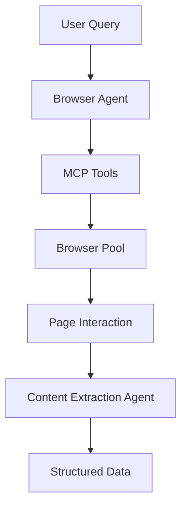

# 🚀 Miss Scraper

> A minimal, scalable, and intelligent web scraping framework powered by AI agents

[](https://python.org)
[](https://github.com/agno-framework/agno)
[](https://github.com/A-d-i-t-h-y-a-n/zendriver)
[](https://modelcontextprotocol.io)

## ✨ Key Features

Miss Scraper is a **minimal yet scalable** implementation of intelligent web scraping, designed as a lightweight alternative to browser-use while maintaining enterprise-grade capabilities. Our key features include:

- **🎯 Minimal & Scalable**: Unlike browser-use's complex architecture, we provide a streamlined ~**237 lines** of core browser automation code
- **🥷 Maximum Stealth**: Powered by [ZenBrowser](https://github.com/A-d-i-t-h-y-a-n/zendriver) with advanced anti-detection capabilities that bypass sophisticated bot detection systems
- **🧠 Pythonic Plug-and-Play Agentic Architecture**: Built with [Agno](https://github.com/agno-framework/agno), featuring an easy-to-customize, plug-and-play pattern—rapidly integrate RAG, chat storage, and new tools with minimal code.
- **📄 Clean Markdown Extraction**: Powered by crawl4ai for LLM-optimized web content processing
- **⚡ Efficient Context Usage**: Smart separation of browser state and page content for minimal token consumption
- **🔧 Easy MCP Customization**: Seamlessly add new tools, modify existing ones, and compose complex automation workflows
- **📊 Dynamic Data Extraction**: LLM-generated Pydantic schemas ensure uniform, validated JSONL output

## 🥷 Maximum Stealth Capabilities

Miss Scraper leverages **ZenBrowser** (zendriver) for unparalleled stealth in web automation:

### Anti-Detection Features
- **🎭 Browser Fingerprint Spoofing**: Randomized user agents, screen resolutions, and device characteristics
- **🌐 Network Behavior Mimicking**: Human-like request timing and pattern simulation
- **🔧 Advanced Evasion**: Bypass Cloudflare, DataDome, and other sophisticated bot detection systems
- **📱 Device Emulation**: Mobile and desktop device simulation with accurate viewport and touch events
- **🕰️ Timing Randomization**: Human-like delays and interaction patterns
- **⏱️ Smart Network Waiting**: Waits for all network requests to complete ensuring DOM is fully loaded

**Stealth Test**
```python
async def test_webdriver():
    import zendriver as zd
    browser = await zd.start(no_sandbox=True)
    tab: zd.Tab = await browser.get("https://www.browserscan.net/bot-detection")
    await tab.save_screenshot("browserscan.png")
    await tab.close()

if __name__ == "__main__":
    asyncio.run(test_webdriver())
```

## 🎨 Easy Customization

### MCP Tool Extension
Adding new browser tools is straightforward:

```python
@mcp.tool
async def browser_custom_action(param: str, ctx: Context) -> dict:
    """Your custom browser automation"""
    tab = await browser_pool.get_tab(ctx.session_id)
    # Your custom logic here
    return await get_llm_browser_state(tab, interactive_dom_map)
```

### Agentic Model Flexibility

**RAG Integration Example:**
```python
from agno.knowledge import Embeddings
from agno.vectordb import PgVector

browser_agent = Agent(
    name="RAG-Enhanced Browser Agent",
    knowledge_base=Embeddings(
        vector_db=PgVector(table_name="web_knowledge"),
        embedder=OpenAIEmbedder()
    ),
    # ... other configurations
)
```

**Storage Backend Options:**
- **SQLite**: Default, file-based storage
- **PostgreSQL**: Production-grade relational storage  
- **Redis**: High-performance in-memory storage
- **Custom**: Implement your own storage backend

**AI Model Flexibility:**
```python
# Swap AI models easily
from agno.models.openai import OpenAI
from agno.models.anthropic import Claude
from agno.models.google.gemini import Gemini

agent = Agent(
    model=OpenAI(id="gpt-4"),  # or Claude() or Gemini()
    # ... other configurations
)
```

## 🚀 Installation

### 1. Clone and Install Dependencies

```bash
# Clone the repository
git clone https://github.com/eryawww/miss-scraper.git
cd miss-scraper

# Install dependencies
source install.sh
```

### 2. Environment Configuration

```bash
# Create environment file
touch .env
```

**Required API Keys:**

Rename `.env.example` to `.env` and add your API keys:

```env
# Google AI Studio API Key (Required)
# Get from: https://aistudio.google.com
GOOGLE_API_KEY=your_google_api_key_here

# Agno API Key (Optional - for Playground/Dashboard)
# Get from: https://docs.agno.com/introduction/playground
AGNO_API_KEY=your_agno_api_key_here

# Browser Configuration
BROWSER_PAGE_LOAD_WAIT=2
MCP_ENDPOINT=http://localhost:8000
TOOLCALL_TIMEOUT_SECONDS=30
```

## ⚡ Quick Start

Miss Scraper offers **two ways to interact** with the browser automation system:

### 🔧 Start MCP Server (Required)

```bash
source ./scripts/launch_mcp.sh
```

### 💬 Choose Your Interaction Mode

### Option 1: 📡 API Server (Production & Integration)

```bash
source ./scripts/launch_agent.sh
```

**Endpoint:** `POST /api/v1/chat`

**Request:**
```json
{
    "text": "Extract product details from amazon.com/product/xyz",
    "session_id": "optional-session-id"
}
```

**Response:**
```json
{
    "text": "I've extracted the product details for you...",
    "results": {
        "0": {
            "name": "Product Name",
            "price": 29.99,
            "availability": "In Stock"
        }
    },
    "session_id": "uuid-session-id"
}
```

### Option 2: 🎮 Agent Dashboard (Development & Testing)

```bash
source ./scripts/launch_playground.sh
```

The Agno Playground provides a user-friendly chatbot dashboard where you can directly interact with the browser agent, test extraction schemas, and debug automation workflows.

## 🛠️ Available MCP Tools

Our browser automation toolkit provides 7 essential tools through the MCP interface:

### Core Navigation
- **`browser_navigate`** - Navigate to any URL with intelligent page loading
- **`browser_go_back`** - Browser history navigation
- **`browser_scroll`** - Smooth scrolling in both directions

### Interaction
- **`browser_click`** - Click elements by interactive index
- **`browser_type_keyboard`** - Type text with automatic form submission

### Content Extraction
- **`browser_get_page_source`** - Extract clean markdown using crawl4ai for optimal LLM processing
- **`browser_extract_content`** - AI-powered schema-based data extraction with dynamic Pydantic validation

### 🎯 Dynamic Data Extraction

**LLM-Generated Pydantic Schemas:**
```python
# Define extraction schema
schema = {
    'product_name': FieldDef(type='string', required=True),
    'price': FieldDef(type='number', required=True),
    'rating': FieldDef(type='number', required=False)
}

# AI automatically creates Pydantic models and validates output
result = await browser_extract_content(schema)
```

**Guaranteed JSON Structure:**
- **✅ Type Validation**: Automatic string/number/boolean conversion
- **✅ Required Fields**: Ensures id critical data is present
- **✅ Uniform Format**: Consistent structure across all extractions

### 📄 Clean Markdown Extraction

**crawl4ai-Powered Content Processing:**
```python
# Get clean, LLM-optimized markdown from any page
clean_content = await browser_get_page_source()
# Returns: Clean markdown without ads, navigation, or clutter
```

**LLM-Optimized Features:**
- **📝 LLM Native Format**: Easy to understand hierarchy of content
- **⚡ Token Efficiency**: Reduced token usage for LLM processing
- **🔗 Link Preservation**: Maintains important links and references
- **99.9% Completeness**: Ensures that the content is extracted without leftover information

### ⚡ Efficient Context Usage

**Smart Browser State Management:**
```python
# Optimized browser state - only essential information
browser_state = {
    "url": "https://example.com",
    "interactive_elements": [
        {"index": 0, "tag": "button", "content": "Login"},
        {"index": 1, "tag": "input", "content": "Search..."}
    ],
    "total_interactive": 15
}

# Separate page content call when needed
page_content = await browser_get_page_source()  # Only when extracting
```
## 🏗️ Project Structure

Miss Scraper follows a clean, modular architecture designed for scalability and maintainability:

```
miss_scraper/
├── agents/                 # 🤖 AI Agent Modules
│   ├── repository.py      # Agent definitions and factories
│   ├── serve.py          # FastAPI agent server
│   ├── playground.py     # Agno playground integration
│   └── static/           # System prompts and configurations
│       ├── browser_system_prompt.md
│       └── extractor_system_prompt.md
│
└── mcp/                   # 🔧 Model Context Protocol
    ├── serve.py          # MCP server implementation
    └── tools/            # Tool implementations
        └── browser/      # Browser automation tools
            ├── mcp.py    # Core MCP tool definitions
            ├── utils.py  # Browser utilities and helpers
            ├── pool.py   # Browser pool management
            └── schema.py # Data schemas and validation
```

### Core Modules

#### 1. **Agents Module** 🤖
- **Agno-Powered**: Leverages Agno's pythonic agent framework
- **Dual Agents**: Browser navigation agent + Content extraction agent to ensure effective context utilization
- **Persistent Storage**: SQLite-based conversation memory
- **Default Model**: Google's Gemini 2.5 Flash is the most optimal performance to cost ratio

#### 2. **MCP Module** 🔧
- **Tool Composition**: Modular browser automation tools
- **Session Management**: Isolated browser contexts per user session
- **Efficient Context Usage**: Smart separation of browser state and page content for minimal token consumption
- **Clean Content Extraction**: crawl4ai-powered markdown conversion for optimal LLM processing
- **Dynamic Schema Generation**: LLM-powered Pydantic model creation for structured data extraction
- **Uniform JSON Output**: Guarantees consistent, validated data format across all extractions
- **Network Optimization**: Intelligent page load detection and stability assurance (Waits for all network requests to complete before proceeding)

#### 3. **Browser Engine** 🥷
- **ZenDriver Integration**: Maximum stealth browser automation with advanced anti-detection
- **Fingerprint Spoofing**: Automatic browser fingerprint randomization and device emulation
- **Pool Management**: Scalable browser instance management with session isolation

### Agent Workflow



## 🙏 Acknowledgments

Miss Scraper uses some code, especially JavaScript code, from the [browser-use](https://github.com/gregpr07/browser-use) project, including interactive element detection, DOM manipulation scripts, and page state extraction utilities. We've built upon this foundation with a minimalist architecture (~237 lines vs 1000+), Agno-powered agentic design, ZenBrowser stealth capabilities, and optimized LLM context usage.